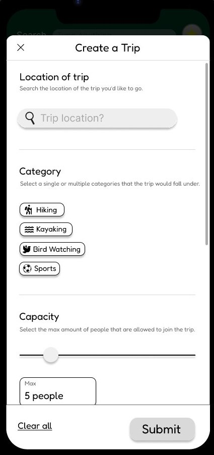
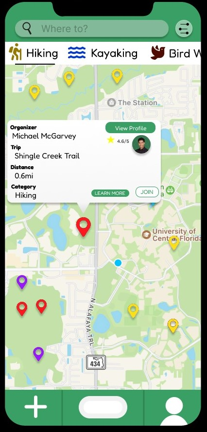

### Rail Sweeper
###### Unity Game Engine, C#, Blender, Unity Version Control
 

<iframe width="610" height="365" src="https://www.youtube.com/embed/A0G27q6DOSw?si=hkNj_AppI3YnGUAb" title="YouTube video player" frameborder="0" allow="accelerometer; autoplay; clipboard-write; encrypted-media; gyroscope; picture-in-picture; web-share" referrerpolicy="strict-origin-when-cross-origin" allowfullscreen></iframe>

 

##### Repo
[Rail Sweeper](https://github.com/Jsomerville1/RailSweeper)

Rail Sweeper is a 3D first-person perspective rhythm game built using Unity and C#. The game was designed and built as a course project for "AI For Game Programming" at the University of Central Florida during the Fall 2024 semester. In Rail Sweeper you click floating notes to clear a path for the train you are riding on, and must also deal with "hold notes" that spawn directly on the track itself. All of this is done in perfect time with the song's beat.

During the project I programmed all of the game systems and implemented all of the visual and audio elements as well. Notes are spawned from an object pool to reduce the overall number of active game objects in the scene at any one time. The notes are spawned accurately using the Melanchall DryWetMIDI library, which reads note positions from a custom made MIDI file. In this manner the notes can be "played" on a regular keyboard while playing along to the song that was being implemented into the game. By using this method I avoided the need to manually set each note position in game. The notes in the MIDI file are quantized for better accuracy (locked to 1/16 notes for example), the BPM is set, and some simple math takes care of spawning the notes in the proper position in the game scene. This ensures that notes are always right on beat, as the song's current position in game is tracked in beats as well.

For added challenge a simple game AI was integrated that keeps track of the player's current "combo" score. The higher the player's combo, the further from their original spawn point and faster the note objects travel. Notes patterns are generated from a graph structure that holds various patterns (spirals, diagonals, zigzags), this prevents the notes from moving in random directions, and increase the game's playability.

During the project I designed and scripted the UI elements as well. Although simple, they are functional and provide a base level of polish necessary for player enjoyment. For example, when songs are completed at each difficulty, this data is saved in the player's game file and updated visually via a star that appears in the level selection menu. Player stats are also tracked for each level and displayed on completion of the song.

### Afterwords

###### MongoDB, Express, React, Node.js, TyhpeScript, JavaScript, Github

[Afterwords Website](http://copteam22.xyz/)

##### Repo
[Afterwords](https://github.com/Jsomerville1/cop4331largeproject)

Afterwords is a web and mobile app that allows users to send email messages and/or PDF files to designated persons if they fail to "check in" for a user defined period of time. For example, if the user does not check in to the app for 6 months, the messages are automatically sent to the user's recipients.

You may like to use the app to send a location of your hike if you haven't checked in for a few hours, for example. It can also be used to send messages or important files to loved ones upon death.

For this project I worked as the project manager, and delegated tasks to other team members. I also worked on API endpoints and some of the front end elements.

### FavoriteLocalDentist.com

###### Wordpress, Nginx, Ubuntu, DigitalOcean Droplets

##### Site Link
[FavoriteLocalDentist](https://favoritelocaldentist.com/)

FavoriteLocalDentist.com was a course project for a Web and UX course at the University of Central Florida. On this project I worked as the business analyist, and interfaced with the client to determine their needs for the website, and translated those into requirements for the design and development team.

During the course of the project I was also responsible for configuring the web server via a DigitalOcean Droplet, on which we ran Ubuntu and Nginx, as well as Wordpress. 

### Touch Grass

###### Engineering Entrepreneurship Group Project

 

Touch Grass is project for an entrepreneurship class that implementes the Lean startup method. We focus on user and partner research and interviews in order to determine product viability before a single dollar is spent on development. Touch Grass is a mobile application that connects people looking for outdoor adventures and activities with those that are organizing these events or have experience and can offer a guiding hand.

##### Github Repo
[Touch Grass](https://github.com/jsomerville1/touch-grass)

### Ready Pet Go

###### Shell Hacks 2023

Ready Pet Go is a Tinder style interface for finding shelter animals that was implemented using Javascript, React, HTML, CSS, and auth0. This was my and my teams first hackathon and while we didn't get everything implemented, we were able to utilize PetFinder.com's API to pull images and descriptions of pets and implement them into the interface.

During the project I worked on implementing Google account login via Auth0.

###### DevPost
[Ready Pet Go on DevPost](https://devpost.com/software/ready-pet-go)

###### Github Repo
[Ready Pet Go on Github](https://github.com/NicTron1/ready-pet-go)